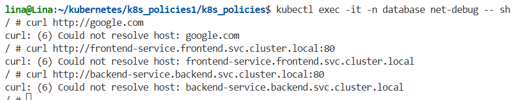

# **Network policies**

This environment demonstrates the application of different network policies at the Kubernetes level using Calico as a network plugin.
In general, the aim was to enable communication between the pods of three components: frontend, backend, and database, ensuring that only the necessary connections between them exist.

## **1. Initialization of the environment**

Minikube was used as the local Kubernetes environment. Therefore, the environment is initialized with the command shown below, which also specifies the necessary network plugin (calico).

```bash
minikube start --cni=calico
```

After that, the status of the related pods is validated

```bash
kubectl get pods -n kube-system
```
### **1.1 Creating namespaces**
The next step is to create the namespaces from the existing *namespaces.yaml* file

```bash
kubectl apply -f namespaces.yaml
```
### **1.2 Applying deployments and services**

Similar to how the namespaces were created, deployments and services are applied. In this case, the following images were used:

- Frontend: nginx:1.25-alpine.

- Backend: nicolaka/netshoot (to perform the corresponding network tests). 

- Database: mariadb:10.6 with environment variables such as *MYSQL_ROOT_PASSWORD*, etc.

To do this, the following commands were used: 

```bash
kubectl apply -f deployments/frontend-deployment.yaml
kubectl apply -f deployments/backend-deployment.yaml
kubectl apply -f deployments/database-deployment.yaml
```
```bash
kubectl apply -f services/frontend-service.yaml
kubectl apply -f services/backend-service.yaml
kubectl apply -f services/database-service.yaml
```
After that, the status of the pods and services must be verified. To do this, use:

```bash
kubectl get pods --all-namespaces
kubectl get svc --all-namespaces
```

### **1.3. Enabling ingress**

To enable ingress, run the command:

```bash
minikube addons enable ingress
```
Once this is done, verify the controller pod by running the command:

```bash
kubectl get pods -n ingress-nginx
```
In addition, apply the file corresponding to ingress:

```bash
kubectl apply -f ingress/frontend-ingress.yaml
```
Then, obtain the IP address using:
```bash
minikube ip
```
And edit the */etc/hosts* file to indicate that the address obtained above will point to *frontend.local*

## **2. Policy application**


The policies presented below were applied in order to create and validate them one by one:

- Frontend policy: 

    - Ingress from the Internet (ipBlock 0.0.0.0/0) to port 80,

    - Egress to backend:80,

    - Egress to CoreDNS (kube-system / k8s-app=kube-dns) TCP/UDP 53 (for internal resolution).

- Backend policy:

    - Ingress only from frontend:80,

    - Egress only to database:3306,

    - Egress to CoreDNS 53.

- DB policy:

    - Ingress only from backend:3306,

    - Egress: [] (none).

Each policy was applied as follows:

```bash
kubectl apply -f policies/frontend-policy.yaml
kubectl apply -f policies/backend-policy.yaml
kubectl apply -f policies/db-policy.yaml

```
## **3. Policy validation**

### **3.1 Validate active pods and services**

Verify that pods and services were created

```bash
kubectl get pods --all-namespaces
kubectl get svc --all-namespaces
```

Expected behavior: frontend, backend, and db pods in *running* status.

### **3.2 Validate ingress**

From the local minikube environment, run

```bash
curl -v http://frontend.local
```

Expected behavior: HTTP response (nginx). This confirms that ingress can access the frontend.
### **3.3 Frontend to backend flow**

Since a pod was created in the frontend namespace, you can use it to access and validate the connection. To do so, run:

```bash
kubectl exec -it -n frontend <frontend_pod_name> -- sh
```
Once inside the pod, run:

```bash
curl -v http://backend-service.backend.svc.cluster.local:80
```

Expected behavior: backend response (200 or HTML).

### **3.4 Frontend to db flow (should not work)**


From the pod in the frontend namespace (or from a test pod within this same namespace):

```bash
curl -v db-service.database.svc.cluster.local:3306
```

Expected behavior: failure (timeout or could not resolve / connection refused). If the DB policy blocks egress, even DNS may fail.


### **3.5 Flow from backend to db**

From the pod in the backend namespace:

```bash
kubectl exec -it -n backend <backend_pod_name> -- sh
```
Once inside: 

```bash
nc -zv db-service.database.svc.cluster.local 3306
```

Expected behavior: TCP connection possible (although the MySQL client will return “protocol” if it is not MySQL). Or, if testing with curl, the connection should be established but it should indicate that it is not hosted there, given the image used for the database. 


### **3.6 Database flow (should not work)**

For this case, a debug pod was used in the database namespace (using praqma image):

```bash
kubectl run net-debug -n database   --image=praqma/network-multitool   --labels=“app=db”   --restart=Never   -- sleep infinity
```
Then, access that pod and test the connections within it, keeping in mind that they should all fail. 


